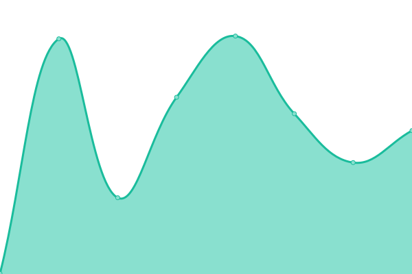

# [📈 Live Status](https://vitals.indicima.ca): <!--live status--> **🟥 Complete outage**

This repository contains the open-source uptime monitor and status page for [Jason T. K.](https://indicima.ca), powered by [Upptime](https://github.com/upptime/upptime).

With [Upptime](https://upptime.js.org), you can get your own unlimited and free uptime monitor and status page, powered entirely by a GitHub repository. We use [Issues](https://github.com/indicima/vitals.indicima.ca/issues) as incident reports, [Actions](https://github.com/indicima/vitals.indicima.ca/actions) as uptime monitors, and [Pages](https://vitals.indicima.ca) for the status page.

<!--start: status pages-->
<!-- This summary is generated by Upptime (https://github.com/upptime/upptime) -->
<!-- Do not edit this manually, your changes will be overwritten -->
<!-- prettier-ignore -->
| URL | Status | History | Response Time | Uptime |
| --- | ------ | ------- | ------------- | ------ |
|  [Indicima.com](https://indicima.ca) | 🟥 Down | [indicima-com.yml](https://github.com/indicima/vitals/commits/HEAD/history/indicima-com.yml) | 

 177ms
     
 | 

<a href="https://vitals.indicima.ca/history/indicima-com">100.00%</a>
    

|  [Indicima® Vitals™](https://vitals.indicima.ca) | 🟥 Down | [indicima-vitals.yml](https://github.com/indicima/vitals/commits/HEAD/history/indicima-vitals.yml) | 

 0ms
     
 | 

<a href="https://vitals.indicima.ca/history/indicima-vitals">100.00%</a>
    

|  [Indicima® Swift™](swift.indicima.ca) | 🟥 Down | [indicima-swift.yml](https://github.com/indicima/vitals/commits/HEAD/history/indicima-swift.yml) | 

 0ms
     
 | 

<a href="https://vitals.indicima.ca/history/indicima-swift">100.00%</a>
    

|  Vitals User | 🟥 Down | [vitals-user.yml](https://github.com/indicima/vitals/commits/HEAD/history/vitals-user.yml) | 

 0ms
     
 | 

<a href="https://vitals.indicima.ca/history/vitals-user">100.00%</a>
    

<!--end: status pages-->

[**Visit our status website →**](https://vitals.indicima.ca)

## 📄 License

- Powered by: [Upptime](https://github.com/upptime/upptime)
- Code: [MIT](./LICENSE) © [Jason T. K.](https://indicima.ca)
- Data in the `./history` directory: [Open Database License](https://opendatacommons.org/licenses/odbl/1-0/)
